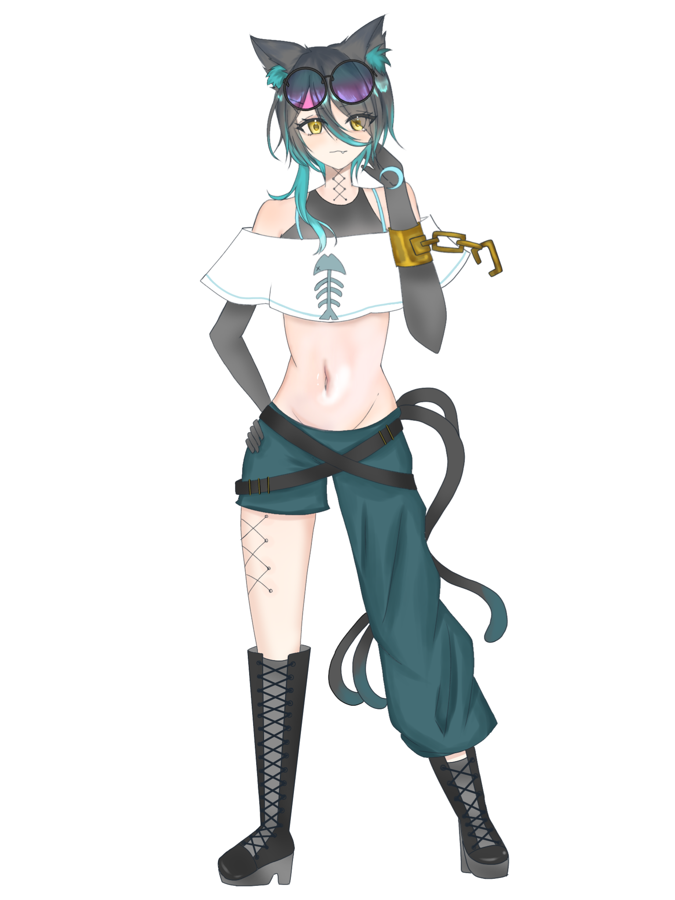
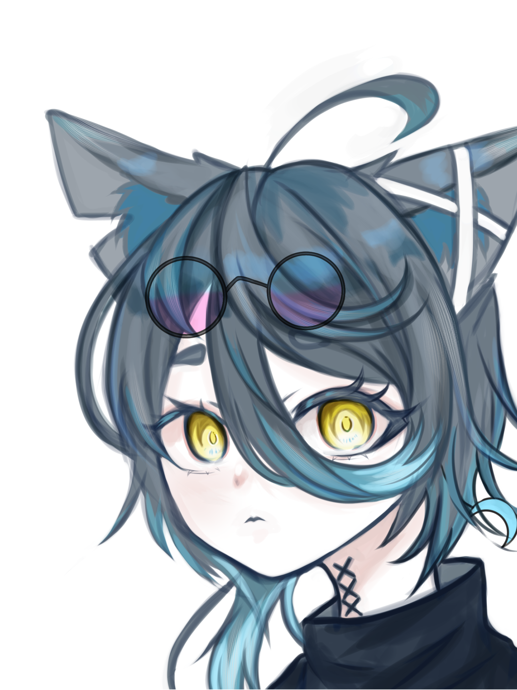
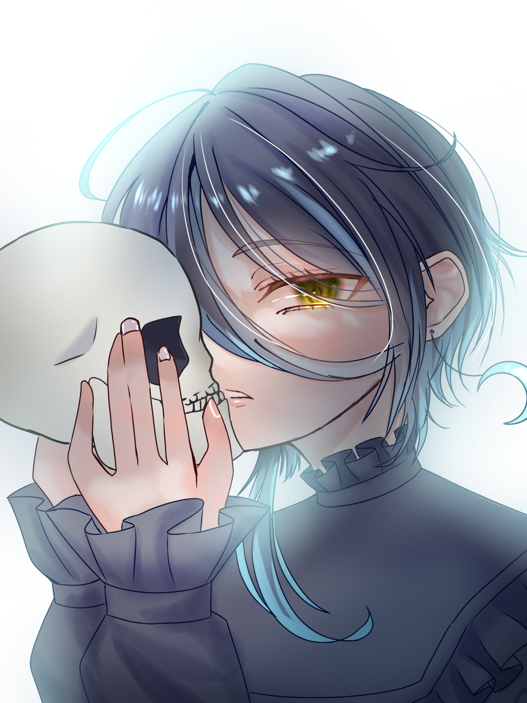
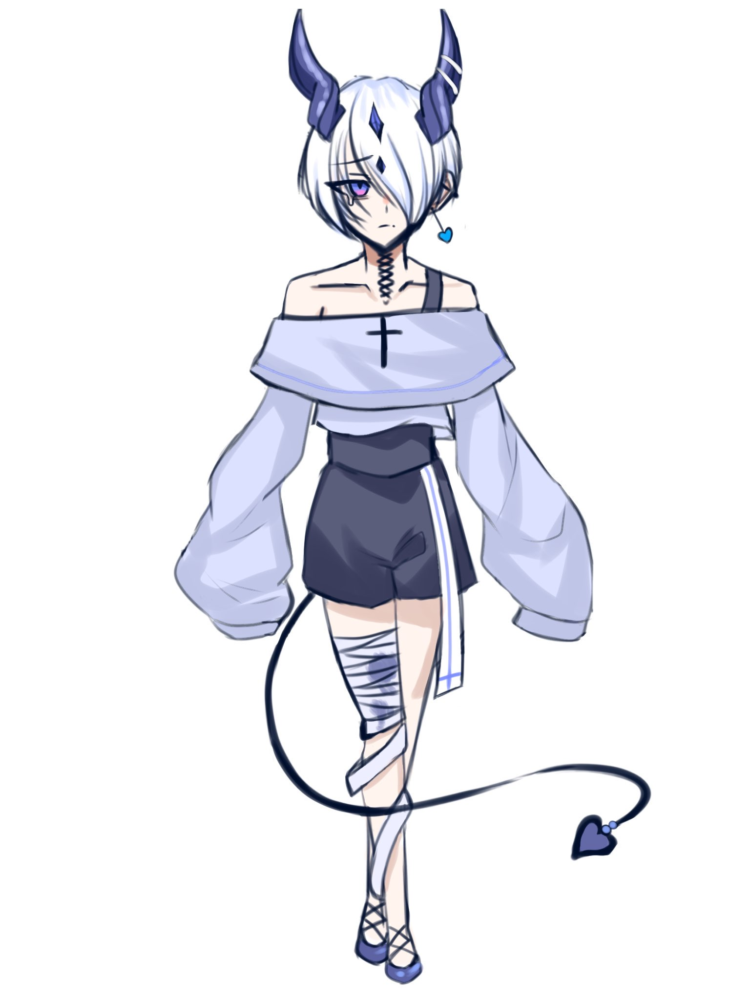
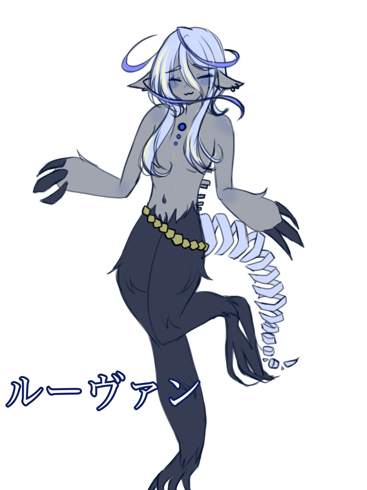

<!DOCTYPE html>
<html lang="ja">

<head>
    <meta charset="UTF-8">
    <meta name="viewport" content="width=device-width, initial-scale=1.0">
    <title>ドットエイチの自己紹介サイト</title>
    <link rel="stylesheet" href="style.css">
</head>

<body>
    <header class="hero">
        <h1>ドットエイチ Portfolio</h1>
        
Illustrator 

    </header>

    <section class="About">
        <h2>About</h2>
        
暗めな表現の中にそっと寄り添うような温かさを含ませたイラストが得意です

    </section>

    <section class="haikei">
    <section class="Profile-title">
        <h2>Profile</h2>
    </section>

    <section class=" Profile">
        
        
20XX年生まれ 女性

        
イラストレーターが子供の頃の夢 
            現在はフロントエンドエンジニアを目指す

        
お菓子とボカロが好き

    </section>

    <section class="Portfolio">
        <h2>Portfolio</h2>
        

            

                
                
            

            

                
                
            

            

                
                
            

        

    </section>

    <section class="Skill">
        <h2>Skill</h2>
        
illustrator そこそこできる

        
photshop そこそこできる

        
clip stadio paint 結構できる

        
ibis paint 完璧

    </section>
</section>

</body>

</html>
